#  TaxiApp Repositorio Oficial

TaxiApp is an innovative project in your portfolio that represents a mobile application designed specifically for the taxi sector in Colombia. TaxiApp's main value proposition is to modernize and simplify the current taxi system, significantly facilitating the service request process for users. The application is designed to be adaptable and useful for various taxi companies, suggesting a versatile and customizable platform.

---

### TaxiApp Features

- **Phone Login:** Users can easily access the app using their phone number for a quick and secure login experience.

- **Registration with intuitive design:** The registration process has been designed intuitively to make it easy for users to create an account without complications.

- **Easy Destination Search:** Users can find their destination quickly and easily using the built-in search function.

- **Simplicity in vehicle request:** Requesting a vehicle is easy and fast, allowing users to conveniently obtain transportation with just a few clicks.

- **Intuitive ride interface:** The in-ride user interface provides an intuitive and easy-to-use experience, allowing users to enjoy their ride without any hassle.

- **Proximity-based trip request arrival:** Drivers receive trip requests based on their proximity, ensuring a quick and efficient response to user requests.

- **Ease of viewing trip progress:** Users can easily view the progress of their trips in real time, allowing them to be informed at all times about their location and estimated time of arrival.

- **Travel History:** Users have access to a detailed history of their previous trips, allowing them to track their travel activities and expenses.

- **Full interface control:** Users have full control over their experience in the application, being able to customize and adjust settings according to their preferences.

---

### Application installation

You can download and install the app from the following app stores:

- [App Store (iOS)](https://apps.apple.com/co/app/taxiapp-review/id6474160293)
- [Google Play Store (Android)](https://play.google.com/store/apps/dev?id=7440498311019256785)

---

### More of My Work

Here is an additional list of my works and projects:

1. **[Borhood](https://github.com/santiagogalo/Borhood_Oficial):** It is an innovative project in your portfolio that represents a mobile application designed specifically for the taxi sector in Colombia.

2. **[TaxiApp](https://github.com/santiagogalo/TaxiApp):** It is an innovative project in your portfolio that represents a mobile application designed specifically for the taxi sector in Colombia.

3. **FinderAlpha:** is the definitive tool for traders, designed to optimize decision making in the dynamic stock market.

---

### Credits

This project was created and developed by [Santiago Gallo](https://github.com/santiagogalo), Julian Gallo(Laravel, BackEnd) who also came up with the initial prototype.

---

### Contact

You can contact me through the following means:

- Telephone: [Whatsapp](https://api.whatsapp.com/send?phone=573041047207)
- Email: [galo.santiago.g@gmail.com]
- Social networks:
  - [Linkedin](https://www.linkedin.com/in/santiago-gallo-guillen-94a40a264/)

---

### Examples or Demonstrations

    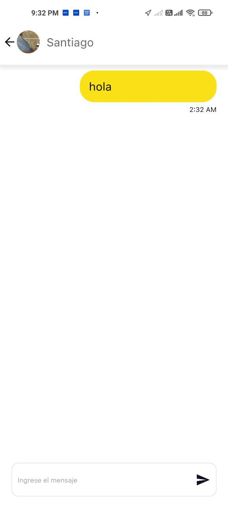
    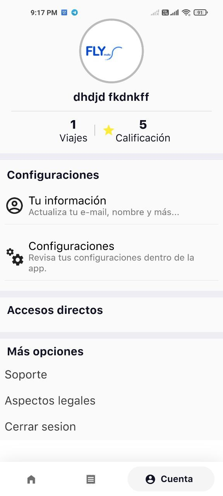
    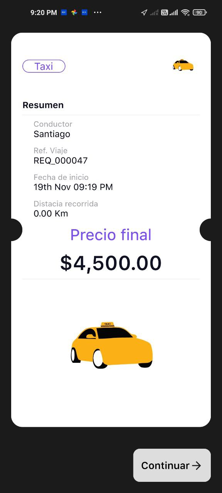
    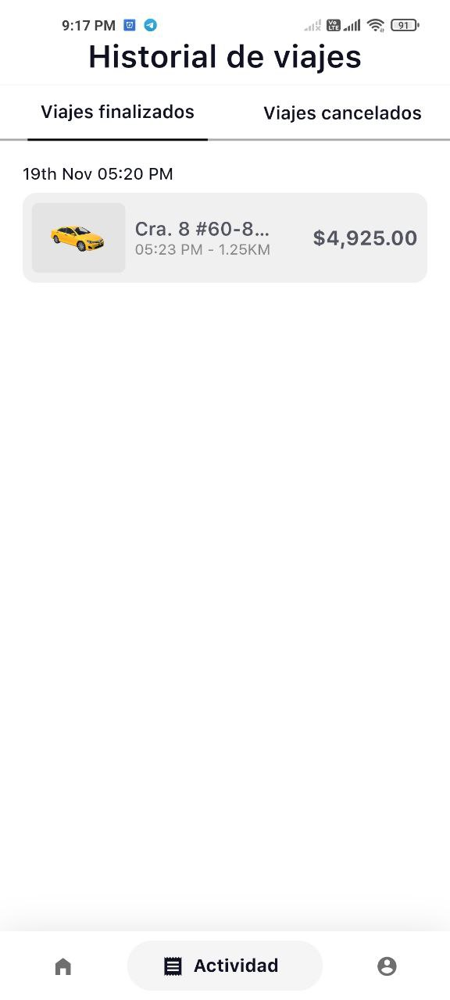
    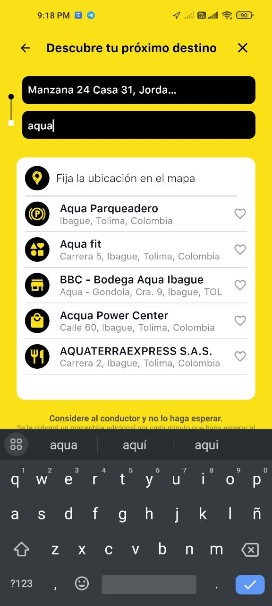
    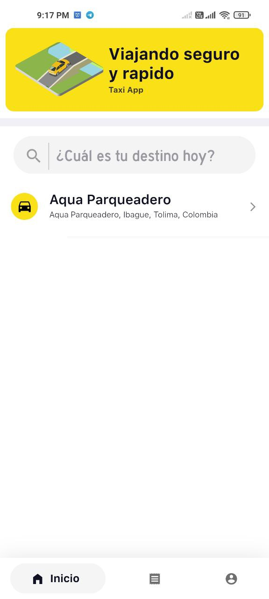
    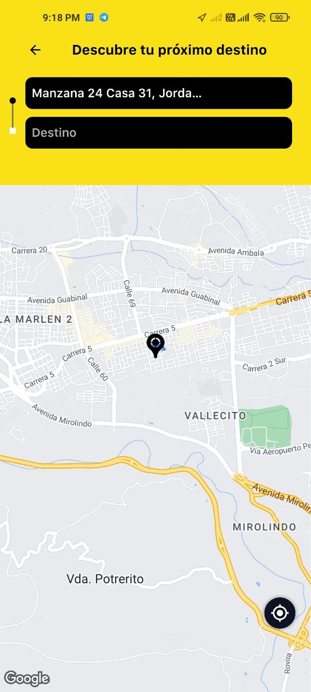
    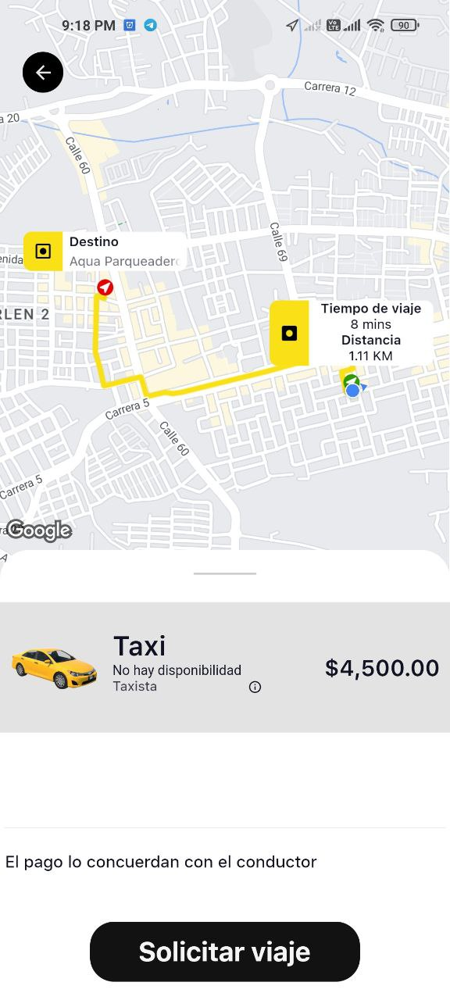
    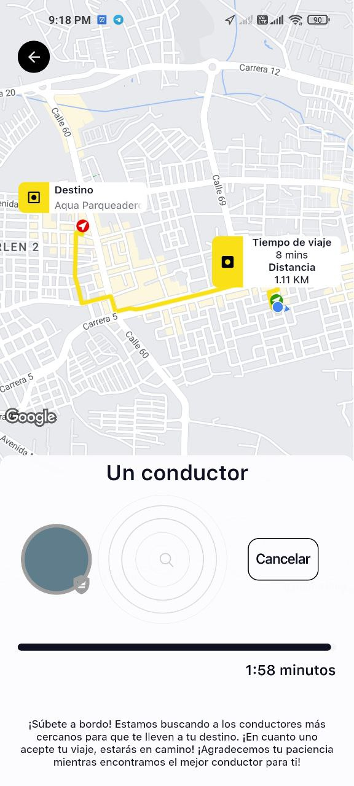
    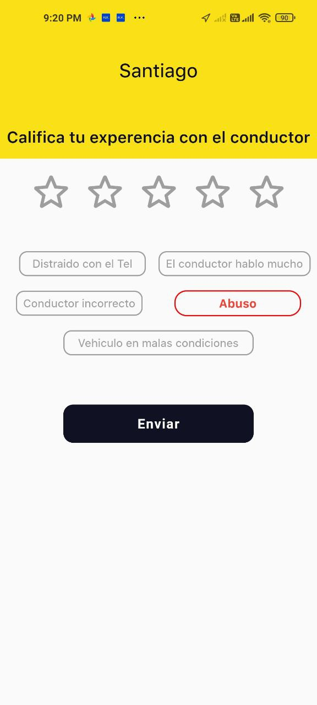
    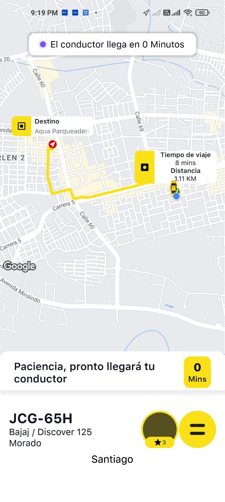
    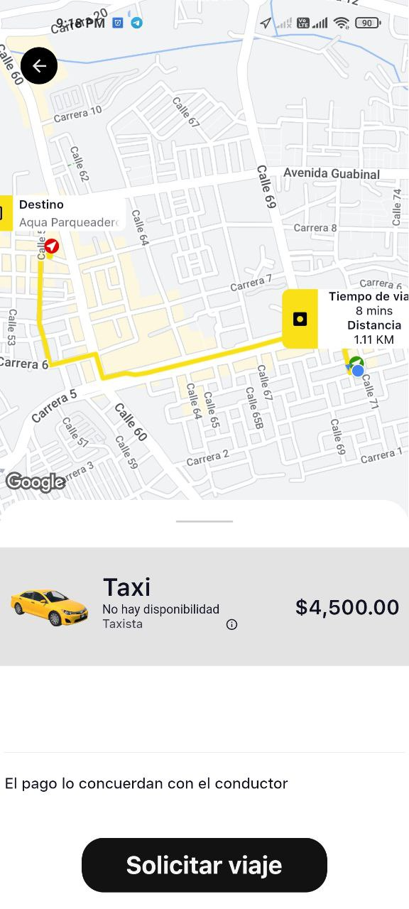
    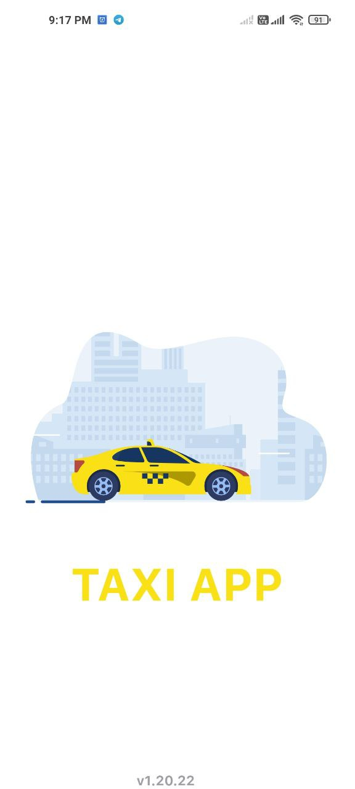
    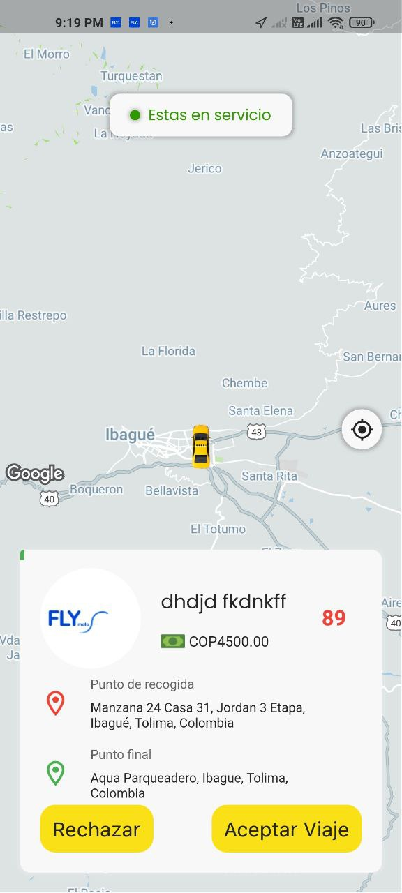

